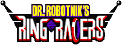

# Dr. Robotnik's Ring Racers

  

Dr. Robotnik's Ring Racers is a kart racing video game originally based on the 3D Sonic the Hedgehog fangame [Sonic Robo Blast 2](https://srb2.org/), itself based on a modified version of [Doom Legacy](http://doomlegacy.sourceforge.net/).

Ring Racers' source code is available to users under the GNU General Public License version 2.0 or higher.

## Links

- [Kart Krew Dev Website](https://www.kartkrew.org/)
- [Kart Krew Dev Discord](https://www.kartkrew.org/discord)
- [SRB2 Forums](https://mb.srb2.org/)

## Disclaimer

Dr. Robotnik's Ring Racers is a work of fan art made available for free without intent to profit or harm the intellectual property rights of the original works it is based on. Kart Krew Dev is in no way affiliated with SEGA Corporation. We do not claim ownership of any of SEGA's intellectual property used in Dr. Robotnik's Ring Racers.

# Development

## Building from Source

Ring Racers is built using a compatible C++ toolchain (GCC, MinGW, Clang and Apple Clang as of this writing), CMake, and Microsoft vcpkg. The compiler and runtime libraries must support the ISO C++17 standard and ISO C11 standard.

On Linux platforms, you will need the following libraries available on the system.

- libcurl
- zlib
- libpng
- libogg
- libvorbis
- libvpx
- libyuv
- SDL2
- libopus

On Windows and macOS, you will need to install [vcpkg] instead to build these dependencies alongside the game.

[vcpkg]: https://vcpkg.io/en/

To configure and build the game, there are [CMake presets] (declared in `CMakePresets.json`). These presets require the ninja build script tool in addition to cmake and your C++ toolchain. Here is a non-exhaustive list of them:

- ninja-debug: non-optimized, assertions enabled
- ninja-develop: optimized, assertions enabled
- ninja-release: optimized
- ninja-x86_mingw_static_vcpkg-debug
- ninja-x86_mingw_static_vcpkg-develop
- ninja-x86_mingw_static_vcpkg-release
- ninja-x64_osx_vcpkg-debug
- ninja-x64_osx_vcpkg-develop
- ninja-x64_osx_vcpkg-release
- ninja-arm64_osx_vcpkg-debug
- ninja-arm64_osx_vcpkg-develop
- ninja-arm64_osx_vcpkg-release

[CMake presets]: https://cmake.org/cmake/help/latest/manual/cmake-presets.7.html

These presets depend on the `VCPKG_ROOT` environment variable being specified before the first run of the `cmake` command. Their build directories are pre-configured as subdirectories of `build/`.

After all prerequisites are set-up, configure and build using the following commands, adjusting according to your target system:

    cmake --preset ninja-x86_mingw_static_vcpkg-develop
    cmake --build --preset ninja-x86_mingw_static_vcpkg-develop

## Contributing

We welcome external contributions from the community. If you are planning on making a large feature you intend to contribute to the project, please consider reaching out to us in the Kart Krew Dev public Discord server so we can coordinate with you.

Our primary source repository is [hosted on gitlab.com](https://gitlab.com/kart-krew-dev/ring-racers). The Github repository is a mirror of this. If you submit a Pull Request to the Github repository, please keep in mind that we do not consistently monitor that mirror and may not see your request.

All contributions must be made available under the GPL General Public License version 2.0, or public domain. Integrations for third party code must be made to code which is compatibly licensed.

